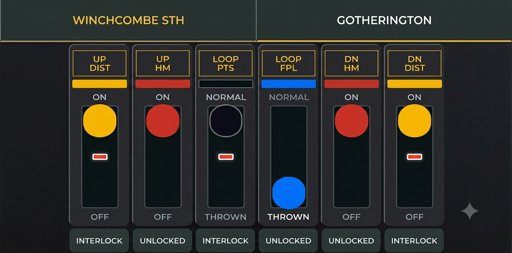
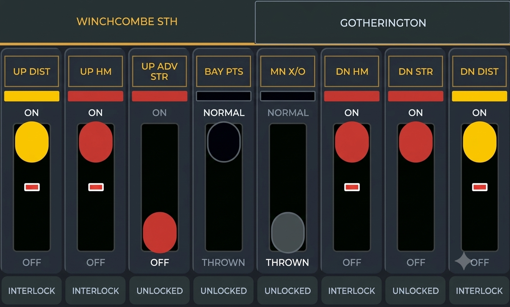

# ESP32 Lever Frame v1.1.0

An ESP32-based application specifically designed for the **Waveshare ESP32-S3-Touch-LCD-4.3** device to control and manage a wireless virtual lever frame. This project features full OpenLCB / LCC (Layout Command Control) integration over Wi-Fi, allowing for two-way event parsing and dynamic lever state updates, making it ideal for model railway control systems.

## Hardware Requirements

* **Waveshare ESP32-S3-Touch-LCD-4.3** display module (Part Number/SKU: **25948**).
  * **IMPORTANT:** This project is specifically designed for the *original* standard version of this display. It is **NOT** compatible with the "B" (ESP32-S3-Touch-LCD-4.3B) or "C" (ESP32-S3-Touch-LCD-4.3C) variants due to differences in their hardware and interface configurations.

## Key Features

* **Wireless Operation**: Fully wireless connectivity utilizing the ESP32's built-in Wi-Fi, eliminating the need for complex physical wiring to your layout.

* **OpenLCB / LCC Integration**: Comprehensive support for Layout Command Control protocols, handling two-way event parsing, state reporting, and dynamic lever state synchronization.
* **Web Configuration Interface**: A built-in Wi-Fi and web server UI for easy configuration of LCC events, network settings, and device parameters.
* **State Persistence**: Non-Volatile Storage (NVS) is used to save and restore lever states, including manual lock collar states and startup modes, ensuring reliable operation across reboots.
* **High-Performance Touch UI**: A fully custom-built virtual lever frame interface that forms the core of the application, featuring highly optimized memory buffering for smooth, tear-free operation, gesture controls, and a responsive informational drawer.
* **Prototypical Interlocking Engine**: A mathematically flawless C-logic engine that bidirectionally models physical mechanical tappet locking, preventing deadlocks and supporting complex route dependencies like Facing Point Locks (FPLs) and conditional "OR" logic.
* **Live Web Simulator**: A built-in simulator allows you to preview and debug complex interlocking logic in real-time, matching exactly how the physical frame behaves with permanent locking visuals.
* **Interlocking Conflict Policies**: Advanced configuration for LCC events and interlocking rules.

## Prerequisites

To bridge the wireless Wi-Fi LCC events from this device to a physical CAN-based layout, a **Wi-Fi to CAN LCC bridge** is required. The most common and recommended approach is to use JMRI.

### Bridging with JMRI (LCC Hub)
Assuming you have your USB-to-CAN adapter configured and working in JMRI:
1. In the main JMRI window (PanelPro or DecoderPro), go to the **LCC** menu (or **OpenLCB** depending on your connection prefix).
2. Click on **Start Hub** (or "LCC Hub"). This starts a GridConnect TCP server (usually on TCP port 12021) that bridges the network to your CAN bus.
3. In the Lever Frame's Web Configuration Interface, ensure the Wi-Fi is connected to the same network as the JMRI computer.

## Getting Started

This project is built using the ESP-IDF framework (v6 compatible).

1. Clone this repository. Make sure to include the submodules:
   ```bash
   git clone --recursive <repository-url>
   ```
2. Configure your ESP-IDF environment.
3. Build, flash, and monitor the project using standard ESP-IDF commands:
   ```bash
   idf.py build flash monitor
   ```

## Example Configuration

We have included a highly prototypical demonstration configuration in `docs/json/prototypical_interlocking.json`. This layout is an excellent example of sequential signaling, mutually locking facing points, and conditional 'OR' route locking.

To load this configuration:
1. Open the Web UI in your browser.
2. Click the **Import** button in the header and select the `docs/json/prototypical_interlocking.json` file.
3. The layout will load into the live simulator. Click **Save & Apply** to push it to your ESP32 device!

### North Junction (Main Frame - 8 Levers)
This frame protects a junction where a branch line diverges from a main line.
- **Lever 1 (UP DISTANT)**: The approach signal. *Locks Lever 2 REVERSED OR Lever 5 REVERSED*. This demonstrates conditional 'OR' logic: the distant signal can be cleared if either the Main or Branch home signals are clear.
- **Lever 2 (UP MAIN HOME)**: Clears the train straight ahead. *Locks Lever 4 NORMAL and Lever 3 REVERSED*.
- **Lever 3 (FPL FOR POINTS 4)**: The Facing Point Lock.
- **Lever 4 (JUNCTION POINTS)**: The physical turnout. *Locks Lever 3 NORMAL*, ensuring the points cannot be moved unless the physical bolt (FPL) is withdrawn.
- **Lever 5 (UP BRANCH HOME)**: Clears the train to turn off onto the branch line. *Locks Lever 4 REVERSED and Lever 3 REVERSED*.
- **Lever 6 (SPARE)**
- **Lever 7 (DOWN ADVANCED)**
- **Lever 8 (DOWN HOME)**

### South Box (Yard Frame - 4 Levers)
This frame controls a small yard crossover.
- **Lever 1 (SHUNT AHEAD)**: A shunting disc. *Locks Lever 2 REVERSED*.
- **Lever 2 (YARD CROSSOVER)**: The physical points for the crossover. *Locks Lever 3 REVERSED*.
- **Lever 3 (FRAME RELEASE)**: A ground frame release mechanism.
- **Lever 4 (SPARE)**

## Interface Screenshots

*Note: These images are AI enhanced photos of a real display.*


*Winchcombe South tab showing 8 levers with corresponding locking states.*


*Gotherington tab showing 6 levers in various interlocking states.*

## License

This project is licensed under the GNU General Public License v3.0 (GPLv3). See the [LICENSE](LICENSE) file for more details.
